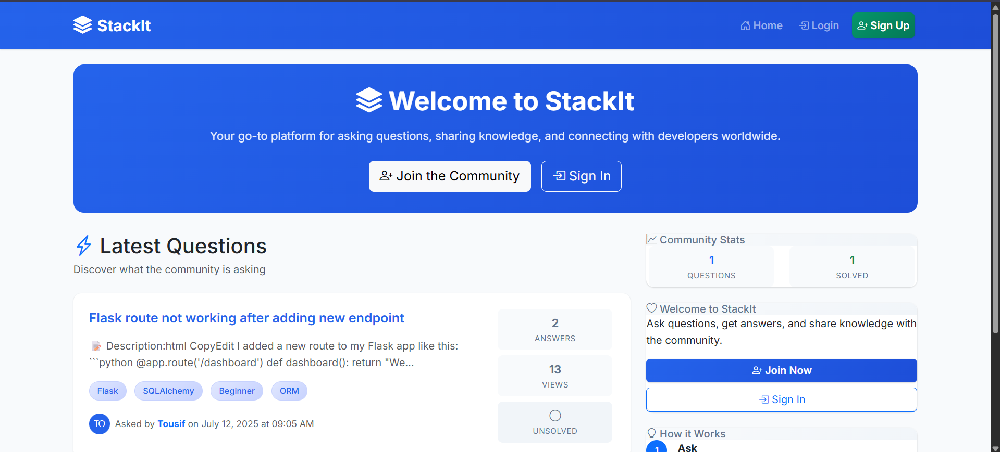
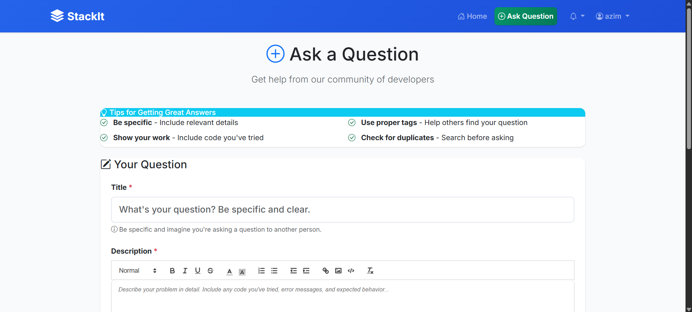
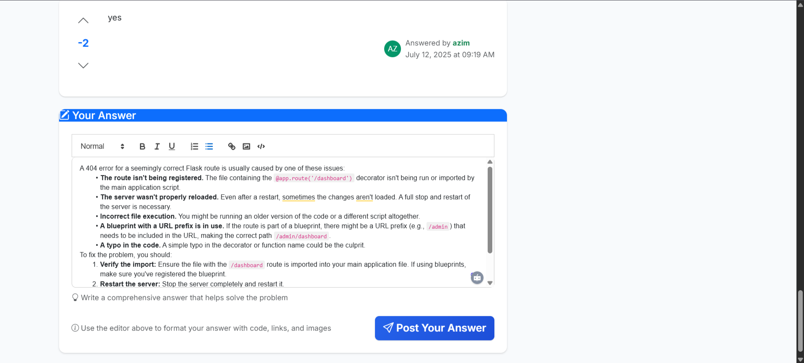
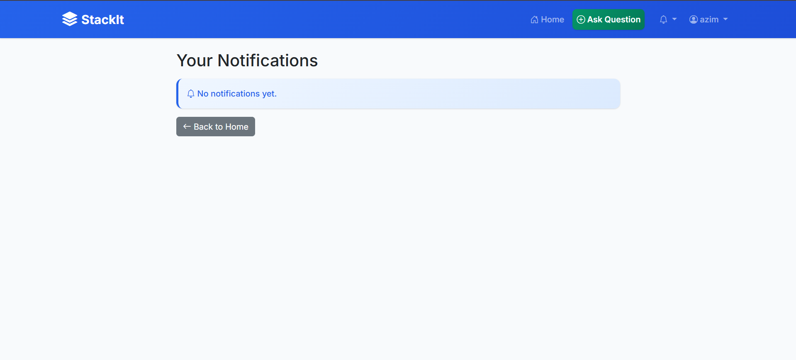

  


# STACKIT

A StackOverflow-style Q&A platform built with Flask + SQLite. Users can ask questions, answer, @mention, vote, and get notifications. Admins can manage users, delete questions, and ban accounts.

## Live Demo
- Replit: https://f1decd1c-d349-49f8-86d2-caef1d6d3350-00-2awhbe1osuel9.pike.replit.dev/

## Features
- Auth: sign up / login / logout
- Ask & answer questions
- @Mentions + notifications
- Voting (+1 / −1)
- Admin dashboard (manage users & questions)
- Markdown/Quill editor
- Image uploads

## Tech Stack
- Python (Flask, Flask-Login, SQLAlchemy, Jinja2)
- SQLite
- Bootstrap + custom CSS

---

## Run Locally

### Option A - Poetry (recommended)
```bash
# 1) clone
git clone https://github.com/Tousif18/stackit.git
cd stackit

# 2) install deps
pipx install poetry  # if you don't have Poetry
poetry install

# 3) run
poetry run python main.py
```
### Option B - pip (if you insist)
```
# create & activate a venv, then:
pip install -r requirements.txt
python main.py
```
If using Option B, generate requirements.txt once via:
poetry export -f requirements.txt -o requirements.txt --without-hashes

### Configuration
Create a .env file (not committed) for secrets:
```
FLASK_SECRET_KEY=change-me
DATABASE_URL=sqlite:///app.db
```
The app reads from environment variables; fallbacks exist for local dev.

## Screenshots

### Home Page


### Ask Question


### Answer Question


### Notifications



## Roadmap

- **Search & Pagination** for easy navigation through questions
- **User Profiles & Reputation**: track activity, ask/answer history, badges
- **Tags System**: categorise questions and filter by topics
- **Accept Answers & Voting Scoreboard**: highlight best solutions and contributions
- **Notifications**: get notified on mentions, answers, and comments
- **Docker + CI**: containerise the app and add automated testing via GitHub Actions

## License

MIT
